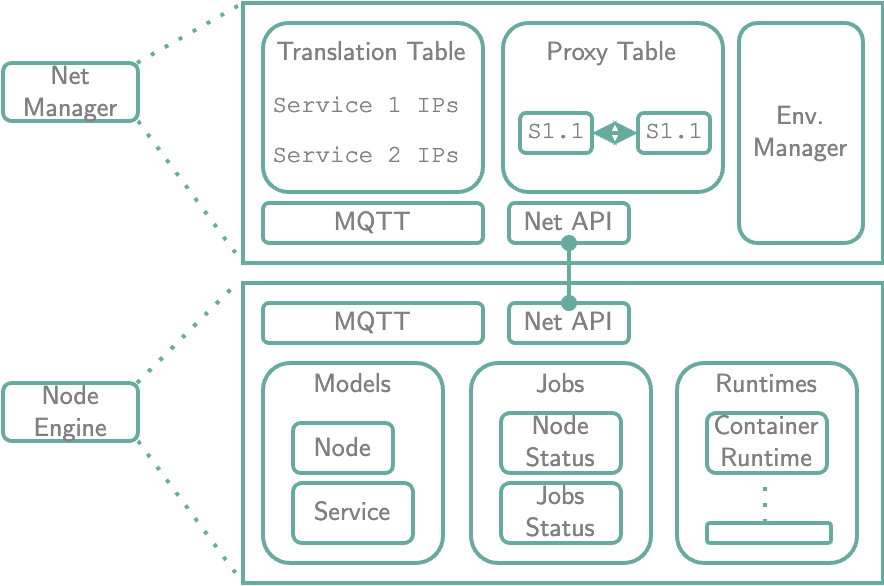

# Oakestra Architecture

As shown in our [getting started](../../getting-started/deploy-your-first-oakestra-cluster/) guide, Oakestra requires 4 key building blocks to operate:
* The [Root Orchestrator](#root-orchestrator)
* The [Cluster Orchestrator](#cluster-orchestrator)
* The [Node Engine](#node-engine), and 
* The [Net Manager](#net-manager)

# Root Orchestrator

The root orchestrator is the centralized control plane that coordinates the participating clusters.



The above image describes the components of the root orchestrator. Each component is deployed as a separate container
and docker-compose is used to integrate and run them.

* The **System Manager** is the interface by which users access the the system as an application deployment platform.
It exposes 2 sets of APIs:
    1. To receive [deployment commands](../../getting-started/deploy-app/with-the-api/) from users
    2. To handle child Oakestra Clusters
* The **Scheduler** calculates a suitable cluster for a given application
* **Mongo** is the interface used to access the database. The root manager stores aggregated information on it's
child clusters. Oakestra differentiates between
    1. *Static metadata* such as the IP-address, port number, name and location of each cluster
    2. *Dynamic data* such as worker nodes per cluster, total CPU cores and memory, total disk space, GPU capabilities, etc...
<!--* The root network components Todo: link to networking-->

## Failure and scalability

The key drawback of a centralized control plane is that is creates a single point of failure. Oakestra mitigates this by ensuring
that the clusters are able to satisfy the SLAs for deployed applications, the only affected functionalities are the deployment of
new services and intra-cluster migrations.
<!--Todo: To avoid failure and increase resiliency, an idea is to make the component able to scale by introducing a load balancer in front of the replicated components. However, this feature is not implemented yet-->

# Cluster Orchestrator



The cluster orchestrator is a twin of the root, with the following distinctions:
* The scope of the cluster orchestrator the is worker nodes
* A key duty performed is aggregation. A cluster orchestrator aggregates the worker node
resources and obscures the cluster composition to the root
* MQTT is used for intra-cluster communication

# Scheduling

At each level, schedulers receive job placement tasks and return a placement decision. At the root level a
cluster is chosen for a given service. At the cluster level a worker node is chosen.



A job placement task is comprised of a service with it's instances and resource requirements.
Currently placement follows the best-fit algorithm.

# Worker Node

A worker node is a machine running the NodeEngine and the NetManager. The former enables the
deployment of applications according to the runtimes installed. The latter provides networking
components to enable inter-application communication.

The NodeEngine is a single binary implemented using Go and is composed of the following modules:
* **MQTT:** The interface between the worker and the cluster. Deployment commands, node status
updates and job updates use this component.
* **Models:** Models that describe the nodes and jobs  
    * Node: Describes the resources that are transmitted to the cluster. These are decomposed into static 
    resources, which are only transmitted at startup, and dynamic resources, which are periodically
    updated, e.g. CPU/memory
    * Service: Describes the services that are managed by this worker node, as well as the real-time
    service usage statistics
* **Jobs:** Background jobs that monitor the the status of the worker node and the deployed applications
* **Runtimes:** The supported system runtimes. Currently containers and Unikernels are supported