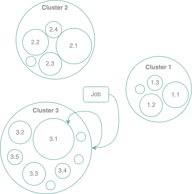
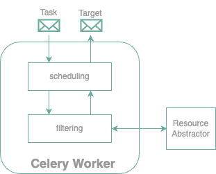
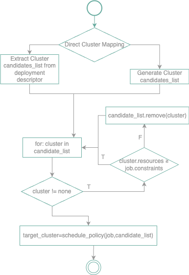

## How does the scheduling work in Oakestra?

Oakestra's architecture is composed of two tiers. Resources are divided into clusters. A cluster is seen as the aggregation of all its resources. A job is first scheduled to a cluster, and then the cluster scheduler decides the target worker.  

{< figure src="scheduling-architecture.png" alt="Scheduling Architecture" caption="Scheduling Architecture" >}

The scheduling component is as simple as a Celery worker. The scheduler receives a job description and gives back an allocation target. We differentiate between the Root scheduler and Cluster scheduler. The Root scheduler finds a suitable cluster (step 1), and the Cluster scheduler finds a suitable worker node (step 2).
To abstract the target resource, we use a `Resource Abstractor`. This service transforms a cluster or a worker node into a generic resource with some capabilities. This ensures interoperability between cluster and worker selection algorithms. 

This filtering component reduces the search space, and the scheduling algorithm can focus on the most suitable candidates. The filtering is based on the job requirements and the resource capabilities.


The resource abstractor component is currently experimental and deployed only at the root. Therefore, up to the current version, the cluster scheduler still interacts directly with the cluster resources. Future releases will include the resource abstractor in the cluster scheduler as well to maximize the interoperability between the scheduling algorithms.


## Scheduling Algorithm

At each layer, the scheduling decision consists of the creation of a `candidate_list` of clusters (or workers) called **filtering** process, and finally, the selection of the "best" candidate according to a scheduling algorithm.

The `schedule_policy` algorithm is implemented in the `calculation.py` component of each respective scheduler.  

The current released version only implements **best fit** and **first fit** calculation strategies. However, on its way to the release, we have our new LDP algorithm (check it out on our [whitepaper](https://arxiv.org/pdf/2207.01577.pdf)).

## Job Constraints

The Job deployment descriptor allows a developer to specify constraints of 4 types: node **resources**, **network** capabilities, **geographical** positioning, and **direct** mapping. 

### Resources

The job resource requirements cause the immediate exclusion of a candidate from the candidate list. These resources represent the bare minimum required by the job to operate properly. Here there is a table of the supported resources and the state of development:

|Resource type|Status|Comments|
|---|---|---|
|Virtualization|🟢|Fully functional containers and unikernel support. |
|CPU|🟢|Only number of CPU cores   
|Memory|🟢|Memory requirements in MB
|Architecture|🟢| It's possible to use the Architecture selector to specify a target hardware. 
|Cluster|🟢| It's possible to use the Cluster selector to limit a deployment to a pre-defined cluster.
|Node|🟢| It's possible to use the Node selector in combination with a Cluster selector to limit a deployment to a pre-defined node of a cluster.
|Geo|🟠| Under development, the possibility to filter resources based on geographical coordinates.
|Bandwidth|🟠| Under development, the possibility to filter resources based on data rate limitations.
|Storage|🟠|It is possible to specify it, but it is not **yet** taken into account by the scheduler 
|GPU|🟠|Possibility of specifying the GPU cores. But not yet the available GPU drivers. Right now, the support is only for CUDA.
|TPU|🔴|Not yet under development

### Network & Geo constraints

The networking requirements selection and geographic constraints support are coming out in our next release, **v0.5**, and are part of the LDP algorithm update. Stay tuned. 

### Direct mapping positioning

It is possible to specify a **direct mapping** constraint. Therefore, in the deployment description, a developer can specify a list of target clusters and nodes. The scheduling algorithm operates only on the active clusters (or nodes) among the given list. 

This direct mapping approach is currently based on `cluster names` and `worker hostnames`. We are also considering adding a label-based positioning where it is possible to tag resources with custom-defined labels. Stay tuned for more.

