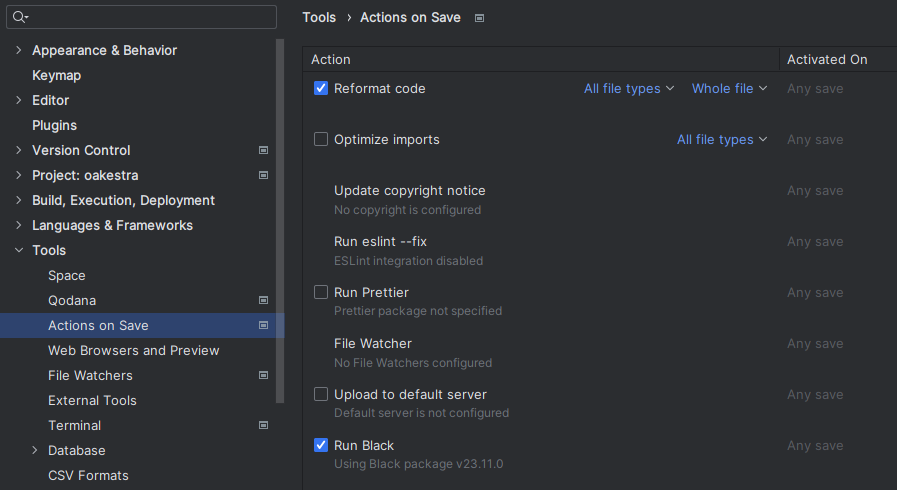
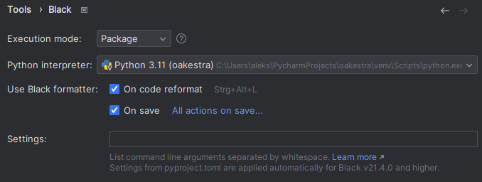
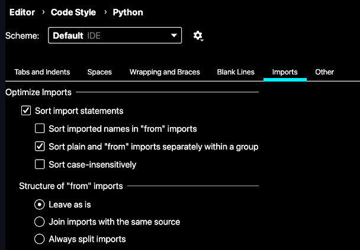

## High-Quality Code: A Shared Understanding

Spending additional time to write high-quality, readable code is crucial for success in software engineering. Clear and easily comprehensible code not only saves time during development but also simplifies onboarding and collaboration.

In case you are interested, we recommend the following reads for improving your code quality.
- [You Spend Much More Time Reading Code Than Writing Code](https://bayrhammer-klaus.medium.com/you-spend-much-more-time-reading-code-than-writing-code-bc953376fe19)
- [Google Python Style Guide: Block and Inline Comments](https://google.github.io/styleguide/pyguide.html#385-block-and-inline-comments)
- [Google Python Style Guide: Punctuation, Spelling, and Grammar](https://google.github.io/styleguide/pyguide.html#386-punctuation-spelling-and-grammar)

## Why Follow a Code Style Guide?

A shared code style ensures:
- Uniform and high-quality code that is easier to understand and maintain.
- Simplified onboarding for new team members.
- Fewer errors caused by inconsistencies.

To align with industry standards and avoid reinventing the wheel, we adhere to **PEP 8** ([Python Enhancement Proposal 8](https://peps.python.org/pep-0008/)).

## Tools for Code Style Enforcement

To make following these guidelines easier, we use the following established, production-grade tools.







We’ll demonstrate how to install, use, and automate these tools in your terminal and IDE.

### Black

Black is a Python code formatter that enforces a consistent style by automatically adjusting your code to match its uncompromising formatting rules. It ensures uniformity and saves time by eliminating manual formatting efforts.

#### Installation
```bash
pip install black
```

#### Terminal Usage

Run Black on files or directories:
```bash
black --line-length 100 .
```

To preview changes without modifying files:
```bash
black --line-length 100 --check --diff --color .
```


We recommend setting the line length to 100 for better readability.


Now you can integrate Black into your favorite IDE. We will show you how to do this in VSCode and PyCharm.




1. Install the [**Black Formatter**](https://marketplace.visualstudio.com/items?itemName=ms-python.black-formatter) extension from Microsoft.
2. Open **Settings**.
3. Enable **Editor: Format On Save**.
4. Set **Black Formatter** as the default formatter.




1. Install the [**BlackConnect**](https://plugins.jetbrains.com/plugin/14321-blackconnect) plugin.
2. Install `blackd` via pip.
3. Run `blackd` to start the Black server.
4. Configure PyCharm to use `blackd` for formatting and enable auto-formatting on file save.
   
   a) Run Black on file save and refactor.
   

   

   b) If you want the plugin to start the `blackd` connection on IDE startup, make sure to provide the path to your local blackd installation.
   

You can then trigger the black formatting by pressing  `Alt + Shift + B`.



### Flake8

Flake8 is a Python linting tool that analyzes code for style guide enforcement, logical errors, and potential bugs. It provides detailed error codes to help maintain code quality and adherence to standards like PEP8.

#### Installation
```bash
pip install flake8
```

#### Terminal Usage
Using Flake8 is very similar to using Black. Unlike Black however, Flake8 cannot fix its found issues on its own because semantics are a lot more complex than syntax.
```bash
flake8 --max-line-length=100 .
```
Now you can integrate Flake8 into your IDE. 




1. Install the [**Flake8**](https://marketplace.visualstudio.com/items?itemName=ms-python.flake8) extension from Microsoft.
2. Flake8 will highlight errors in the code and display error codes when you hover over them.




While PyCharm lacks native support for Flake8, the following resources may help integrate it.

- [Flake8 for PyCharm](https://pypi.org/project/flake8-for-pycharm/)
- [GitHub Gist: Flake8 in PyCharm](https://gist.github.com/tossmilestone/23139d870841a3d5cba2aea28da1a895)




### isort

`isort` is a Python utility that automatically sorts and organizes imports in your code according to defined standards. It improves code readability and maintains consistency by grouping and ordering imports logically.

#### Installation
```bash
pip install isort
```

#### Terminal Usage
`isort` behaves very similar to Black. It can automatically perform adjustments or run in “check-only” mode. To adjust imports automatically, run the following command.
```bash
isort .
```

To check for changes without modifying files:
```bash
isort --check-only --diff --color .
```
Integrate `isort` into your IDE workflow as follows.




Install the [**isort**](https://marketplace.visualstudio.com/items?itemName=ms-python.isort) extension from Microsoft to automatically sort imports on file save.



While PyCharm doesn’t natively support `isort`, you can manually configure import settings to align with isort’s behavior.




