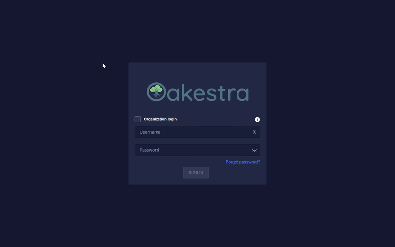

## The Dashboard

Now that you have familiarized yourself with the API, you can try out the dashboard. The dashboard is the front-end component to cluster management.

It allows the user to:
- View the applications currently running on the cluster
- Create and modify individual services
- Check the status of running services
- Configure service-level agreements (SLAs)

## Deployment


- You have a running Root Orchestrator.
- You can access the APIs at `<IP_OF_CLUSTER_ORCHESTRATOR>:10000`


If you deployed your cluster with one of the provided docker-compose files, this has already been done for you and you can simply head over to `<http://IP_OF_CLUSTER_ORCHESTRATOR>`. Otherwise follow the instructions below.

### Manual deployment:

**0)** Clone the repository

```bash
git clone https://github.com/oakestra/dashboard.git && cd dashboard
```

**1)** Create a file that contains the environment variables

```bash
echo "API_ADDRESS=<IP_OF_CLUSTER_ORCHESTRATOR>:10000" > .env
```

**2)** Run the dashboard

```bash
sudo docker-compose up
```

### Running the Oakestra Framework

To be able to log into the dashboard, the System Manager and MongoDB must be started. 
How this can be done is described in the [getting started](../../getting-started/deploy-your-first-oakestra-cluster/) section.

If these components were not started or improperly configured, the login screen can be reached, but you cannot log in to the dashboard.

## Accessing the dashboard

Now that the dashboard is up and running, let's log in and explore its functionality.
Upon launching the system for the first time, an administrative user is automatically created.
This user can create and manage other users and organizations within the system, more on [User Management](../explore-its-features/#user-management) later.

> **Admin Credentials**\
> Username: `Admin`\
> Password: `Admin`


After setting up the cluster manager immediately change the password of the admin user!


## Organization Login

<!-- Todo: What is an organization? -->
To log in to an organization check the *Organization login* box and enter the organization name. If the box is not checked or the organization
name is left empty, then you will logged in to the default ROOT organization.



Here you can see the login to the **sampleOrga**:


