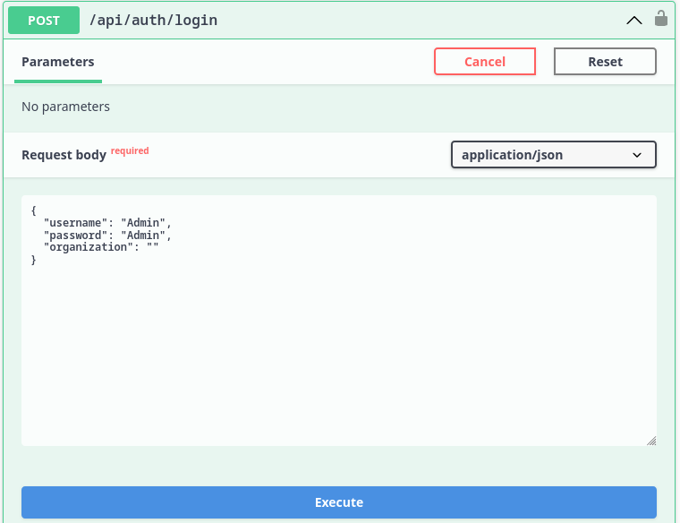
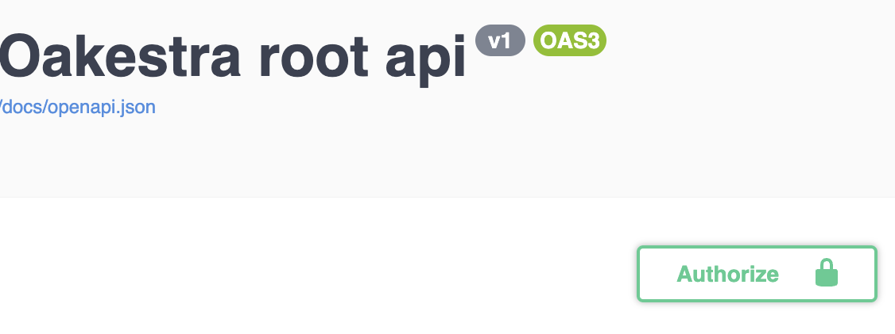


- You have a running Oakestra deployment.
- You have at least one Worker Node registered
- You have installed and properly configured the NetManager.
- You can access the APIs at `<root-orch-ip>:10000/api/docs`


Let's try deploying an Nginx server and a client. Then we'll enter inside the client container and try to curl `Nginx` webserver.

All we need to do to deploy an application is to create a deployment descriptor and submit it to the platform using the APIs.

### Deployment Descriptor

In order to deploy a container a deployment descriptor must be passed to the deployment command.
The deployment descriptor contains all the information that Oakestra needs in order to achieve a complete
deploy in the system.

Oakestra uses the following deployment descriptor format.

```yaml {title="deploy_curl_application.yaml"}
{
  "sla_version" : "v2.0",
  "customerID" : "Admin",
  "applications" : [
    {
      "applicationID" : "",
      "application_name" : "clientserver",
      "application_namespace" : "test",
      "application_desc" : "Simple demo with curl client and Nginx server",
      "microservices" : [
        {
          "microserviceID": "",
          "microservice_name": "curl",
          "microservice_namespace": "test",
          "virtualization": "container",
          "cmd": ["sh", "-c", "tail -f /dev/null"],
          "memory": 100,
          "vcpus": 1,
          "vgpus": 0,
          "vtpus": 0,
          "bandwidth_in": 0,
          "bandwidth_out": 0,
          "storage": 0,
          "code": "docker.io/curlimages/curl:7.82.0",
          "state": "",
          "port": "9080",
          "added_files": []
        },
        {
          "microserviceID": "",
          "microservice_name": "nginx",
          "microservice_namespace": "test",
          "virtualization": "container",
          "cmd": [],
          "memory": 100,
          "vcpus": 1,
          "vgpus": 0,
          "vtpus": 0,
          "bandwidth_in": 0,
          "bandwidth_out": 0,
          "storage": 0,
          "code": "docker.io/library/nginx:latest",
          "state": "",
          "port": "6080:80/tcp",
          "addresses": {
            "rr_ip": "10.30.30.30"
          },
          "added_files": []
        }
      ]
    }
  ]
}
```

Save this description as `deploy_curl_application.yaml` and upload it to the system using the APIs.

This deployment descriptor example generates one application named *clientserver* with the `test` namespace and two microservices:
- nginx server with test namespace, namely `clientserver.test.nginx.test`
- curl client with test namespace, namely `clientserver.test.curl.test`



### Login to the APIs

After running a cluster you can use the debug OpenAPI page at `<root_orch_ip>:10000/api/docs` to interact with the apis and use the infrastructure.

Authenticate using the following procedure:

1. Locate the login method and use the try-out button


2. Use the **default Admin credentials** to login

    ```json
    {
      "username": "Admin",
      "password": "Admin",
      "organization": ""
    }
    ```

3. Copy the result login token


4. Go to the top of the page and authenticate with this token



### Register an application and the services
After you authenticate with the login function, you can deploy your first application.

1. Upload the deployment descriptor to the system. You can try the one above.


The response contains the Application id and the id for all the application's services. Now the application and the services are registered to the platform. It's time to deploy the service instances!

You can always remove or create a new service for the application using the `/api/services` endpoints

### Deploy an instance of a registered service

1. Trigger a deployment of a service's instance using `POST /api/service/{serviceid}/instance`

Each call to this endpoint generates a new instance of the service

### Monitor the service status

1. With `GET /api/applications/<userid>` (or simply /api/applications/ if you're admin) you can check the list of the deployed application.
2. With `GET /api/services/<appid>` you can check the services attached to an application
3. With `GET /api/service/<serviceid>` you can check the status for all the instances of `<serviceid>`

### Undeploy the service

- Use `DELETE /api/service/<serviceid>` to delete all the instances of a service
- Use `DELETE /api/service/<serviceid>/instance/<instance number>` to delete a specific instance of a service
- Use `DELETE /api/application/<appid>` to delete all together an application with all the services and instances

### Check if the service (un)deployment succeeded

Familiarize yourself with the API and discover for each one of the service the status and the public address.

If both services are **ACTIVE**, it is time to test the communication.

 If either of the services are not ACTIVE, there might be a configuration issue or a bug. You can check the logs of the NetManager and NodeEngine components with `docker logs system_manager -f --tail=1000` on the root orchestrator, with `docker logs cluster_manager -f --tail=1000` on the cluster orchestrator. If unable to resolve, please open an [issue on GitHub](https://github.com/oakestra/oakestra/issues/new/choose). 

Try to reach the nginx server you just deployed.

```bash
http://<deployment_machine_ip>:6080
```

If you see the Nginx landing page, you just deployed your very first application with Oakestra! Hurray! 🎉

<!-- If you want to try the semantic addressing, move into the worker node hosting the client and use the following command to log into the container.

```bash
sudo ctr -n edge.io task exec --exec-id term1 Client.default.client.default /bin/sh
```

Once we are inside our client, we can curl the Nginx server and check if everything works.

```bash
curl 10.30.30.30
```

Note that this address is the one we specified in the Nginx's deployment descriptor. -->
