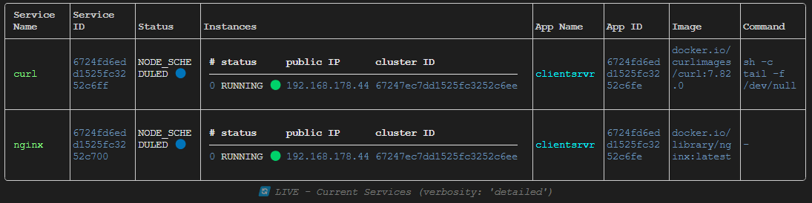
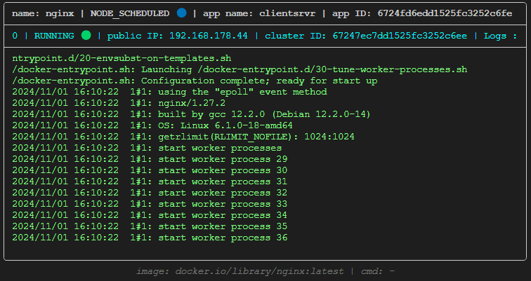
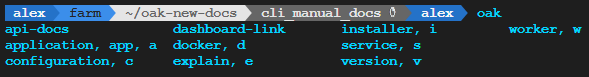

In addition to using the API directly or clicking through the dashboard UI, you can also interact with Oakestra using the Oakestra Command Line Interface.


- You have a running Root Orchestrator.
- You can access the APIs at `<IP_OF_CLUSTER_ORCHESTRATOR>:10000`
- You have read and familiarized yourself with the [API]() and [Dashboard]() approaches.


## The OAK CLI

The benefits of using this CLI are:
- Easy installation via pip
- Native Interface for the Oakestra APIs
  - Eliminates the need to use external third-party tools
- Accelerated & Simpler Workflows
  - Removes the need to memorize necessary API endpoints
  - Automates tedious tasks away
    - E.g. Acquiring the Login Token
  - The CLI commands can be chained together and used in custom scripts

## CLI Setup

You can install the CLI via `pip install oak-cli`.

When you run the CLI for the first time it will welcome you.


### Configurating the CLI

The OAK CLI supports a growing array of different scenarios based on the concrete Oakestra use case and user preferences.

This CLI initially hides many of its commands to avoid overwhelming new users.
Additionally, not every user needs every available command, and not every command makes sense in every situation or environment.

To configure the set of shown commands run `oak configuration local-machine-purpose`.


Most `oak` commands have shorter aliases that enable shorter commands and easier combinations, thus faster workflows.

E.g. Instead of typing out `oak configuration local-machine-purpose`.
Simply run `oak c l`.

The available aliases are shown directly in the `-h` output.


The CLI will ask you a set of questions about your intended use and your target environment.
Based on your Yes/No responses it will provide you with the matching set of commands.



<br>

This configuration is persistently stored on your machine.

Configuring your OAK-CLI is optional yet highly recommended.
You can always revert your configuration to its initial state.

For further  information about configuring the CLI see the **CLI Manuals**.

## Basic CLI Usage

The root command for the CLI is **oak**


Every `oak` CLI command comes with its own help text to support your understanding.

Simply add `--help` or `-h` to any command to find out more.


### Working with Application SLAs

As detailed in the [API Approach]() Oakestra services and their applications are defined in SLAs.

The OAK-CLI comes with a set of pre-defined default SLAs.

All available SLAs can be inspected via the `oak application sla` command.


<br>

All SLAs are stored in your home directory in the `oak_cli` folder.
It gets automatically populated when you install the CLI.

```bash {frame="none"}
~/oak_cli
├── SLAs
│   ├── blank_app_without_services.json
│   ├── default_app_with_services.json
│   └── mysla.json
├── .init_flag
├── .oak_cli_config
└── addons
   └── flops
         └── ...
```

To modify or add new custom SLAs just modify the content of your `~/oak_cli/SLAs` folder.
E.g. The `mysla.json` is a custom SLA that we added after installing the CLI.

### Managing Applications
Now that we are familiar with the SLAs we can start creating applications based on them.

Run `oak application show` (`oak a s`) to see the currently orchestrated applications.

The `oak application create` (`oak a c`) command asks you what SLA should be used as the blueprint for the new application and creates that app for you.

Delete one or all currently running apps via `oak application delete` (`oak a d`).




### Deploying Services

The services of our applications are not yet deployed.

To deploy instances of these services we need to know the service IDs.

The IDs are visible when running `oak service show`.

Click on your desired Service ID value in the Service ID column and copy it via `Ctrl+C`.

To deploy a new instance run `oak service deploy <YOUR_SERVICE_ID>`.


<br>
You can undeploy all instances of a service or only specific ones by providing the appropriate command option  `oak service undeploy --service-id <YOUR_SERVICE_ID> / --instance-id <INSTANCE_ID>`.


You can create an application and automatically deploy its services by providing the `-d` *(for deploy)* flag to the `oak app create (-d)` command. 





You can display apps and services with different levels of verbosity/detail and automatically refresh the display to stay in the know about the latest changes.
.
You can even display and automatically follow the latest service logs.
.

For further details and recorded examples see the **CLI Manuals**.



## Further Details & All Available Commands



The OAK-CLI is powered by [Typer](https://github.com/fastapi/typer) which supports tab autocompletion natively.

This means that you can press your **tab** key to either automatically complete the command you are currently typing or get a list of matching available commands.
There is no need to memorize or fully type the commands.



Simply run `oak --install-completion` to enable this feature.


This page only highlights a small subset of available OAK-CLI capabilities.

For more details on every available CLI command and more see the **CLI Manuals**.

