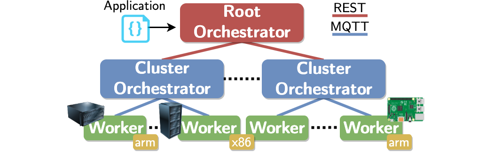

Oakestra lets you deploy your workload on devices of any size. From a small RasperryPi to a cloud instance far away on GCP or AWS. The tree structure enables you to create multiple clusters of resources.

* The **Root Orchestrator** manages different clusters of resources. The root only sees aggregated cluster resources.
* The **Cluster orchestrator** manages your worker nodes. This component collects the real-time resources and schedules your workloads to the perfect matching device.
* A **Worker** executes your workloads. Each node can support multiple execution environments such as Containers (containerd runtime), MicroVM (containerd runtime), and Unikernels (mirageOS).

 Since the stable Accordion release, Oakestra supports both containers and unikernel virtualization targets. 



Root and Cluster orchestrator (combined):
- Docker + Docker Compose v2
- 5GB of Disk
- 1GB of RAM
- ARM64 or AMD64 architecture

Worker Node:
- Linux based distro with iptables compatbiliety 
- 50MB of space
- 100MB RAM
- ARM64 or AMD64 architecture



### Setup Your First Cluster

Install your first **Root** and **Cluster Orchestrator** using:

```bash
curl -sfL oakestra.io/getstarted.sh | sh - 
```


Run this export before the previous command to deploy the Development version of Oakestra

```bash
export OAKESTRA_BRANCH=develop
```




Install your **Worker Node** components on every Linux machine you want to use as worker running:

```bash
curl -sfL https://raw.githubusercontent.com/oakestra/oakestra/develop/scripts/InstallOakestraWorker.sh | sh -  
```

Then, startup each **Worker Node** using the following command:

```bash
sudo NodeEngine -a <IP address of your cluster orchestrator> -d
```

the `-d` flag runs the NodeEngine in background (detatched mode)


Check if your worker is running and it's correctly registered to your cluster:
```bash
sudo NodeEngine status
```

If everything is showing up green 🟢... Congratulations, your cluster is set up! 🎉


You can check the NodeEngine logs using 

```bash
sudo NodeEngine logs
```




If you run into a restricted network (e.g., on a cloud VM) you need to configure the firewall rules and the NetManager component accordingly. Please refer to: [NetworkConfiguration](#advanced-network-configuration)  


### Add a New Cluster to your Infrastructure.

If you want to create new Clusters to attatch to you Oakestra Root, on each Cluster Orchestrator machine you can run:

```bash
curl -sfL https://raw.githubusercontent.com/oakestra/oakestra/develop/scripts/StartOakestraCluster.sh | sh -
```

This will start a new **Cluster Orchestrator** component. 
A script will ask you for your 
 - **Cluster name** : A name of your choice for this cluster. 
 - **Location** : Geographical coordinates and radius of competence in meters, e.g.:`48.1374,11.5755,1000`
 - **IP address of the Root Orchestrator**



All these variables can be set before startup exporting them:
```bash
export CLUSTER_LOCATION=<latitude>,<longitude>,<radius>
export CLUSTER_NAME=my_awesome_cluster
export SYSTEM_MANAGER_URL=<url or ip>
```


Run this export before the cluster startup to deploy the Development version of the Cluster Orchestrator

```bash
export OAKESTRA_BRANCH=develop
```




You can attatch new worker nodes to this cluster using the same procedure shown in [Setup Your First Cluster](#setup-your-first-cluster)

### Shutdown the Components

To stop your **Root & Cluster** orchestrator components run:

```bash
docker compose -f /u/home/bartolom/oakestra/1-DOC.yaml down
```

To stop each one of the additional clusters you configured, run:

```bash
docker compose -f /u/home/bartolom/oakestra/cluster-orchestrator.yml down
```

To stop a worker node use:

```bash
sudo NodeEngine stop
```

### Advanced Network Configuration

If you run into a restricted network (e.g., on a cloud VM) you need to configure the firewall rules accordingly

Root: 
  - External APIs: port 10000
  - Cluster APIs: ports 10099,10000

Cluster: 
  - Worker's Broker: port 10003
  - Worker's APIs: port 10100

Worker: 
  - P2P tunnel towards other workers: port 50103 


Additionally, the NetManager component, responsible for the worker nodes P2P tunnel, must be configured. Therefore follow these steps on every **Worker Node**

1) Shutdown your worker node components using 
```bash
sudo NodeEngine stop
````

2) Edit the NetManager configuration file `/etc/netmanager/netcfg.json` as follows:

```json
{
  "NodePublicAddress": "<IP ADDRESS OF THIS DEVICE, must be reachable from the other workers>",
  "NodePublicPort": "<TUNNEL PORT, The PORT must be reachable from the other workers, use 50103 as default>",
  "ClusterUrl": "<IP Address of cluster orchestrator or 0.0.0.0 if deployed on the same machine>",
  "ClusterMqttPort": "10003",
  "Debug": False
}
```

3) Restart the NodeEngine
```bash
sudo NodeEngine -a <IP address of your cluster orchestrator> -d
````


