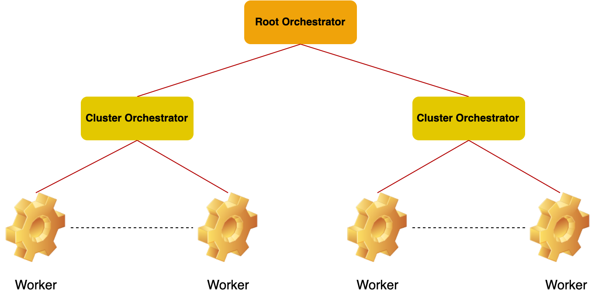
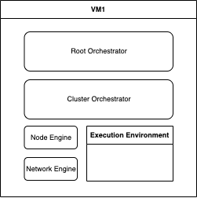
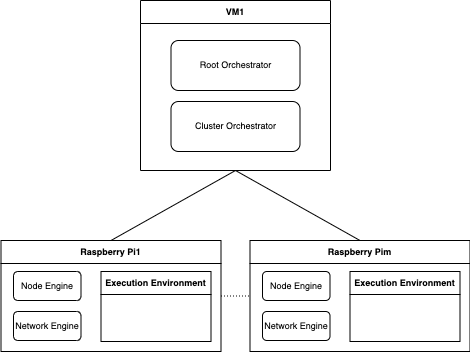
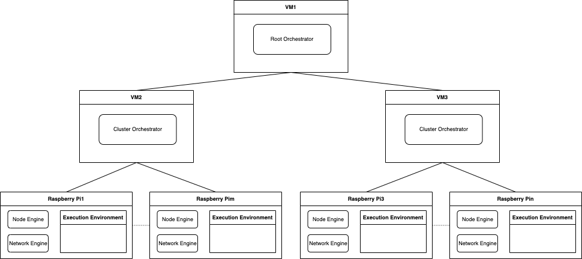

Oakestra lets you deploy your workload on devices of any size. From a small RasperryPi to a cloud instance far away on GCP or AWS. The tree structure enables you to create multiple clusters of resources.

* The **Root Orchestrator** manages different clusters of resources. The root only sees aggregated cluster resources.
* The **Cluster orchestrator** manages your worker nodes. This component collects the real-time resources and schedules your workloads to the perfect matching device.
* A **Worker** is any device where a component called NodeEngine is installed. Each node can support multiple execution environments such as Containers (containerd runtime), MicroVM (containerd runtime), and Unikernels (mirageOS).

 Since the stable Accordion release, Oakestra supports both containers and unikernel virtualization targets. 

## Create your first Oakestra cluster

Let's start simple with a single node deployment, where all the components are deployed on the same device.


- Linux (Workers only)
- Docker + Docker compose (Orchestrators only)
- Cluster Orchestrator and Root Orchestrator machines must be mutually reachable.


### 1-DOC (1 Device, One Cluster)

In this example, we will use a single device to deploy all the components. This is not recommended for production environments, but it is pretty cool for home environments and development.



**0)** First, let's export the required environment variables

```bash
## Choose a unique name for your cluster
export CLUSTER_NAME=My_Awesome_Cluster
## Come up with a name for the current location
export CLUSTER_LOCATION=My_Awesome_Apartment
## Tell the NetManager where to find the system manager
export SYSTEM_MANAGER_URL=<IP of device>
```

<<<<<<< HEAD
<<<<<<< HEAD

You can obtain the public IPv4 address of your device with

```bash
curl -4 https://ifconfig.co
=======

=======

>>>>>>> 8d534109 (NetManager not optional)
You can obtain the public IPv4 address of your device with

```bash
dig whoami.akamai.net. @ns1-1.akamaitech.net. +short
>>>>>>> 540359ff (fixed spelling)
```



**1)** Clone the repository and move into it using:

```bash
git clone https://github.com/oakestra/oakestra.git && cd oakestra
```

**2)** Run a local 1-DOC cluster

```bash
sudo -E docker-compose -f run-a-cluster/1-DOC.yaml up
```


**3)** In another terminal download, untar and install the node engine package

```bash
wget -c https://github.com/oakestra/oakestra/releases/download/v0.4.202/NodeEngine_$(dpkg --print-architecture).tar.gz && tar -xzf NodeEngine_$(dpkg --print-architecture).tar.gz && chmod +x install.sh && mv NodeEngine NodeEngine_$(dpkg --print-architecture) && ./install.sh $(dpkg --print-architecture)
```

**4)** Download, unzip and install the network manager; this enables an overlay network across your services
<<<<<<< HEAD
=======
<<<<<<< HEAD
**4)** Download, unzip and install the network manager; this enables an overlay network across your services
=======
**4)** download, unzip and install the network manager; this enables an overlay network across your services
>>>>>>> 3b0afc6c (1-DOC requires NetManager)
>>>>>>> 540359ff (fixed spelling)
=======
>>>>>>> 8d534109 (NetManager not optional)

```bash
wget -c https://github.com/oakestra/oakestra-net/releases/download/v0.4.202/NetManager_$(dpkg --print-architecture).tar.gz && tar -xzf NetManager_$(dpkg --print-architecture).tar.gz && chmod +x install.sh && ./install.sh $(dpkg --print-architecture)
```
<!-- ( please replace < arch > with your device architecture: **arm-7** or **amd64** ) -->

4.1) Edit `/etc/netmanager/netcfg.json` as follows:

```bash
{
  "NodePublicAddress": "<IP ADDRESS OF THIS DEVICE>",
  "NodePublicPort": "<PORT REACHABLE FROM OUTSIDE, use 50103 as default>",
  "ClusterUrl": "0.0.0.0",
  "ClusterMqttPort": "10003"
}
```
4.2) Start the NetManager on port 6000

```bash
sudo NetManager -p 6000 &
```

<<<<<<< HEAD
<<<<<<< HEAD
**5)** Start the NodeEngine
=======
**5)** Start the NodeEngine. Please only use the `-n 6000` parameter if you started the network component in step 4. This parameter, in fact, is used to specify the internal port of the network component, if any.
>>>>>>> 540359ff (fixed spelling)
=======
**5)** Start the NodeEngine
>>>>>>> 8d534109 (NetManager not optional)

```bash
sudo NodeEngine -n 6000 -p 10100
```
( you can use `NodeEngine -h` for further details )


### M-DOC (M Devices, One Cluster)

Now, let's separate the Oakestra components over multiple devices and create a more distributed cluster.

The M-DOC deployment enables you to deploy One cluster with multiple worker nodes. The main difference between this deployment and 1-DOC is that the worker nodes might be external here, and there can be multiple of them.



The deployment of this kind of cluster is similar to 1-DOC. We first need to start the root and cluster orchestrator. Afterward, we can attach the worker nodes.

**1)** On the node you wish to use as a cluster and root orchestrator, execute steps **1-DOC.1** and **1-DOC.2**

**2)** Now, we need to prepare all the worker nodes. On each worker node, execute the following:

2.1) Download and unpack both the NodeEngine

```bash
wget -c https://github.com/oakestra/oakestra/releases/download/v0.4.202/NodeEngine_$(dpkg --print-architecture).tar.gz && tar -xzf NodeEngine_$(dpkg --print-architecture).tar.gz && chmod +x install.sh && mv NodeEngine NodeEngine_$(dpkg --print-architecture) && ./install.sh $(dpkg --print-architecture)
```

and the NetManager

```bash
wget -c https://github.com/oakestra/oakestra-net/releases/download/v0.4.202/NetManager_$(dpkg --print-architecture).tar.gz && tar -xzf NetManager_$(dpkg --print-architecture).tar.gz && chmod +x install.sh && ./install.sh $(dpkg --print-architecture)
```

2.2) Edit `/etc/netmanager/netcfg.json` accordingly:

```json
{
  "NodePublicAddress": "<IP ADDRESS OF THIS DEVICE>",
  "NodePublicPort": "<PORT REACHABLE FROM OUTSIDE, internal port is always 50103>",
  "ClusterUrl": "<IP ADDRESS OF THE CLUSTER ORCHESTRATOR>",
  "ClusterMqttPort": "10003"
}
```
2.3) Run the NetManager and the NodeEngine components:

```bash
sudo NetManager -p 6000 &
sudo NodeEngine -n 6000 -p 10100 -a <IP ADDRESS OF THE CLUSTER ORCHESTRATOR>
```

### MDNC (M Devices, N Clusters)

This represents the most versatile deployment. You can split your resources into multiple clusters within different locations and with different resources. In this deployment, we need to deploy the root and the cluster orchestrator on different nodes. Each independent cluster orchestrator represents a cluster of resources. The worker nodes attached to each cluster are aggregated and seen as a unique big resource from the point of view of the Root. This deployment isolates the resources from the root perspective and delegates the responsibility to the cluster orchestrator.


**1)** In this first step, we need to deploy the root orchestrator component on a node. To do this, you need to clone the repository on the desired node, move to the root orchestrator folder, and execute the startup command.

```bash
git clone https://github.com/oakestra/oakestra.git && cd oakestra

sudo -E docker-compose -f root_orchestrator/docker-compose-<arch>.yml up
```
( please replace < arch > with your device architecture: **arm** or **amd64** )

**2)** For each node that needs to host a cluster orchestrator, you need to:

2.1) Export the ENV variables needed to connect to the cluster orchestrator:

```bash
export SYSTEM_MANAGER_URL=<IP ADDRESS OF THE NODE HOSTING THE ROOT ORCHESTRATOR>
export CLUSTER_NAME=<choose a name for your cluster>
export CLUSTER_LOCATION=<choose a name for the cluster's location>
```

2.2) Clone the repo and run the cluster orchestrator:

```bash
git clone https://github.com/oakestra/oakestra.git && cd oakestra

sudo -E docker-compose -f cluster_orchestrator/docker-compose-<arch>.yml up
```
( please replace < arch > with your device architecture: **arm** or **amd64** )

**3)** Start and configure each worker as described in M-DOC.2

### Hybrid Deployments

You should have got the gist now, but if you want, you can build the infrastructure by composing the components like LEGO blocks.
Do you want to give your Cluster Orchestrator computational capabilities for the deployment? Deploy an instance of NodeEngine + Netmanager components, and you're done. You don't want to use a separate node for the Root Orchestrator? Simply deploy it all together with a cluster orchestrator.

With Oakestra you can build your infrastructure as you like, and you can always scale it up or down as you need!
