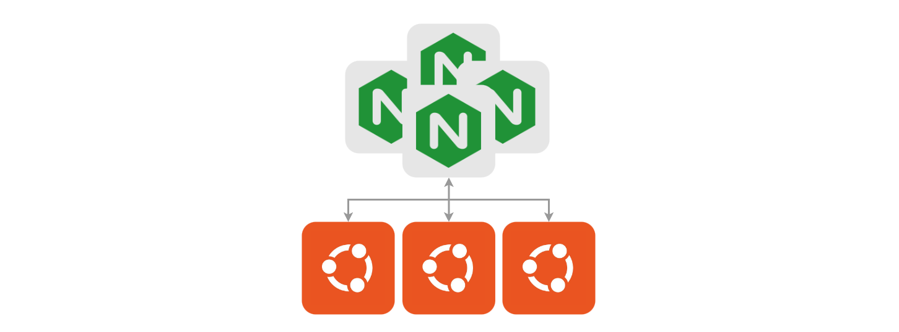
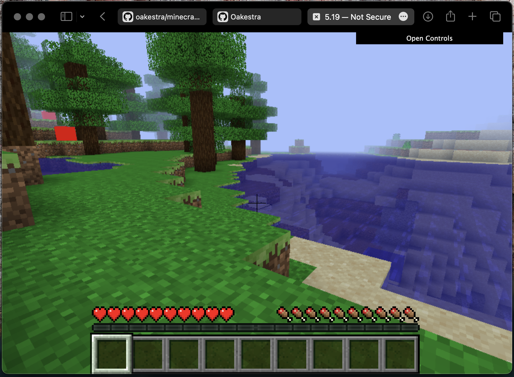

Here, you'll find some examples of applications with their respective SLA template that you can use right away to test out Oakestra.

## Nginx Client-Server with Load Balancing

To test out the balancing capabilities of Oakestra, we can deploy a simple Nginx server and a client that sends requests to a Round-Robin balanced semantic IP assigned to the server. When scaling up the Nginx service, the client requests will automatically be balanced across the service's instances.



## Cloud/Edge Gaming: Minecraft 

Features:
- 🎮 Play Minecraft from a browser, no client installation needed (thanks to [WebMC](https://github.com/michaljaz/webmc))
- 👭 Play multiplayer locally or remotely 
- 🖥️ Host your Minecraft server ([Openhack](https://github.com/noelbundick/minecraft-server)) and proxy. 
- ⚙️ Scale your server instances to handle more users
- 🛠️ Customize your deployment 



## Object Detection Pipeline

You can try out this AR Pipeline composed of three services: 

**Preprocessing**: The preprocessing microservice collects the frames and adapts them for the model.

**Object Detection**: This service detects the bounding boxes inside the image. If Object Recognition is up and running, it forwards the frames there. Otherwise, it sends the bounding boxes back to the client.

**Object Recognitions**: This service receives the frames from object detection. For each bounding box of type "Person" it detects the face features and sends them back to the client.



## Unikraft Web Server

Similarly to the regular Nginx deployment in Oakestra, we can deploy Nginx using [Unikraft](https://unikraft.org) Unikernels. This will allow us to have a more lightweight and isolated version of Nginx for the machines supporting unikernel virtualization.



