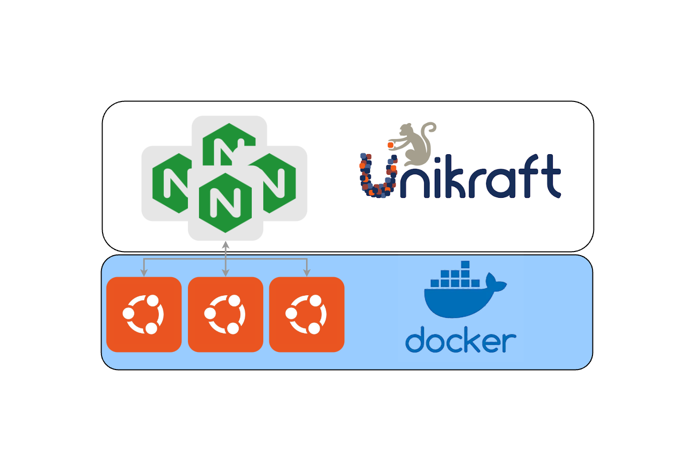

Similarly to the regular Nginx deployment in Oakestra, we can deploy Nginx using [Unikraft](https://unikraft.org). This will allow us to have a more lightweight and isolated version of Nginx for the machines supporting unikernel virtualization.

 To enable unikernel support, please refer to the Unikernel Support manual section

#### SLA Template

For this example, we create a service named `curl` using a `curlimages/curl:7.82.0` docker image. This service performs a curl request to an Okestra semantic IP address of our choice (`10.30.30.31`), and then it fails. After failure, Oakestra will re-deploy the instance indefinitely.

Together with the `curlv4` service, we deploy a Nginx service named `nginx` using the `nginx_amd64.tar.gz` unikraft image hosted online. This service will be assigned a Round-Robin semantic IPv4 address `10.30.30.31`. Since this kernel image is only available for `amd64` architecture, we specify this in the SLA template using `"arch": ["amd64"],` selector.


To find out more about networking, please refer to the [Networking](/docs/manuals/networking-internals) section.


Refer to the following SLA template to deploy the services.

```json {title="~/oak_cli/SLAs/unikernel-nginx-client-server.json"}
{
  "sla_version": "v2.0",
  "customerID": "Admin",
  "applications": [
    {
      "applicationID": "",
      "application_name": "clientsrvr",
      "application_namespace": "test",
      "application_desc": "Simple demo with curl client and Nginx server",
      "microservices": [
        {
          "microserviceID": "",
          "microservice_name": "nginx",
          "microservice_namespace": "nginx",
          "virtualization": "unikernel",
          "cmd": [
            ""
          ],
          "memory": 400,
          "vcpus": 1,
          "vgpus": 0,
          "vtpus": 0,
          "bandwidth_in": 0,
          "bandwidth_out": 0,
          "port": "9000:80",
          "storage": 0,
          "code": "https://github.com/oakestra/oakestra/releases/download/alpha-v0.4.301/nginx_amd64.tar.gz",
          "arch": [
            "amd64"
          ],
          "state": "",
          "addresses": {
            "rr_ip": "10.30.30.31"
          },
          "added_files": []
        },
        {
          "microserviceID": "",
          "microservice_name": "curl",
          "microservice_namespace": "nginx",
          "virtualization": "container",
          "cmd": [
            "sh",
            "-c",
            "curl 10.30.30.31 ; sleep 15"
          ],
          "memory": 100,
          "vcpus": 1,
          "vgpus": 0,
          "vtpus": 0,
          "bandwidth_in": 0,
          "bandwidth_out": 0,
          "storage": 0,
          "code": "docker.io/curlimages/curl:7.82.0",
          "state": "",
          "port": "",
          "added_files": []
        }
      ]
    }
  ]
}
```



In this guide we'll use the Oakestra CLI tool to interact with the Oakestra platform. To find out more about the CLI tool, please refer to the CLI section of the manuals.

 


#### Let's deploy the services
```bash
 oak a c --sla-file-name unikernel-nginx-client-server.json -d
```

 If your SLA file is not in the ~/oak_cli/SLAs directory you can use the following command instead:

```bash
 oak a c --sla-file-name $(pwd)/unikernel-nginx-client-server.json -d
```

 

Now the `curl` service will perform a `curl` request to `nginx`, then it will fail. Oakestra will re-deploy a new instance, and so the cycle will continue.

#### Scale up the Nginx service
Let's fetch the Nginx's Service ID using 
```bash
oak s s
```

Then let's deploy a second Nginx instance using:
```bash
oak s d <Nginx Service's ID>
```

By running `oak s s` you should now see two instances of the Nginx service running.
```bash
╭──────────────┬──────────────────────────┬────────────────┬────────────┬──────────────────────────╮
│ Service Name │ Service ID               │ Instances      │ App Name   │ App ID                   │
├──────────────┼──────────────────────────┼────────────────┼────────────┼──────────────────────────┤
│              │                          │                │            │                          │
│ curl         │ 672cf97ff7728660d15a584d │  0 RUNNING 🟢  │ clientsrvr │ 672cf97fa3ba9aac11ea11af │
│              │                          │                │            │                          │
├──────────────┼──────────────────────────┼────────────────┼────────────┼──────────────────────────┤
│              │                          │                │            │                          │
│              │                          │  0 RUNNING 🟢  │            │                          │
│ nginx        │ 672cf97ff7728660d15a5852 │                │ clientsrvr │ 672cf97fa3ba9aac11ea11af │
│              │                          │  1 RUNNING 🟢  │            │                          │
│              │                          │                │            │                          │
╰──────────────┴──────────────────────────┴────────────────┴────────────┴──────────────────────────╯
```
#### Sit down, relax, and watch the magic happen
Use the following command to check the instance's logs:
```bash
oak s i <Nginx Service ID>
```
You'll see the nginx logs of both instances, and the effects of the resulting balancing.
For this example we used the command `oak s i 672cf97ff7728660d15a5852`

```bash
╭───────────────────────────────────────────────────────────────────────────────────────────────╮
│ name: nginx | NODE_SCHEDULED 🔵 | app name: clientsrvr | app ID: 672cf97fa3ba9aac11ea11af     │
├───────────────────────────────────────────────────────────────────────────────────────────────┤
│ 0 | RUNNING 🟢 | public IP: 131.159.24.51 | cluster ID: 672cf976f7728660d15a583e | Logs :     │
├───────────────────────────────────────────────────────────────────────────────────────────────┤
│ 10.30.0.2 - - [07/Nov/2024:17:41:04 +0000] "GET / HTTP/1.1" 200 615 "-" "curl/7.82.0-DEV" "-" │
│ 10.30.0.2 - - [07/Nov/2024:17:41:34 +0000] "GET / HTTP/1.1" 200 615 "-" "curl/7.82.0-DEV" "-" │
│                                                                                               │
├───────────────────────────────────────────────────────────────────────────────────────────────┤
│ 1 | RUNNING 🟢 | public IP: 131.159.24.51 | cluster ID: 672cf976f7728660d15a583e | Logs :     │
├───────────────────────────────────────────────────────────────────────────────────────────────┤
│ 10.30.0.2 - - [07/Nov/2024:17:37:34 +0000] "GET / HTTP/1.1" 200 615 "-" "curl/7.82.0-DEV" "-" │
│ 10.30.0.2 - - [07/Nov/2024:17:41:19 +0000] "GET / HTTP/1.1" 200 615 "-" "curl/7.82.0-DEV" "-" │
│                                                                                               │
╰──────────────────────────────────────────────────────────────────────────────────────────────
```

As you can see both instances got requests from the single client we have, even is the client is always using the same IP address. 