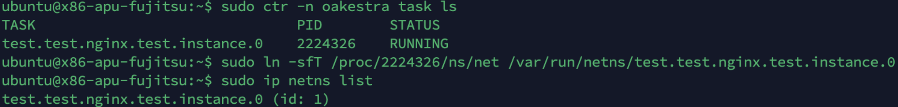

## How do I access the network namespace of a container in my worker node?

When `containerd` generates the network namespace for your container it does not show up out of the box in the network namespace list. In fact, when running:

```
sudo ip netns list
```

You'll get an empty list, even if using 

```
sudo ctr -n oakestra container ls 
```

Will give you a list of running containers. 

<h4>So... what do we do? </h4>

The issue is simple, when a container is deployed and a network namespace is created, the symlink of the net namespace is not automatically created inside the `/var/run/netns` directory. So we just need to do that! 

First, let's retrieve the PID of the container

```
sudo ctr -n oakestra task ls
```




In my case, the PID is `222432`

(Optional)  If not there already, create the /var/run/netns/ directory with mkdir -p /var/run/netns/

Then create the symlink using the command 

```
ln -sfT /proc/<container PID>/ns/net /var/run/netns/<container name>
```

In my case, the command will look like 

```
ln -sfT /proc/222432/ns/net /var/run/netns/test.test.nginx.test.instance.0
```

now if I run the command 

```
sudo ip netns list
```

I'll see the `test.test.nginx.test.instance.0` namespace. 


## How to debug the network

Once the namespace is accessible via the `netns` command, you can enter inside it and debug your environment using the classic utilities such as `tcpdump`/`tshark` and you can check the interfaces using the `ip` utils or execute any command you fancy. You can even create new interfaces inside and play around with them. 

Simply use

```
ip netns exec <containername> <your command>
```

E.g., to show the interfaces inside the namespace of the previous example I can run

```
sudo ip netns exec test.test.nginx.test.instance.0 sudo ip a s`
```


## What about Unikernels network

If you're running unikernels directly using Oakestra native unikernel virtualization, you'll automatically find the namepsace in `ip netns list`.

If you're using `runu` runtime attached to containerd, you can still use the procedure described above for containerd. 
