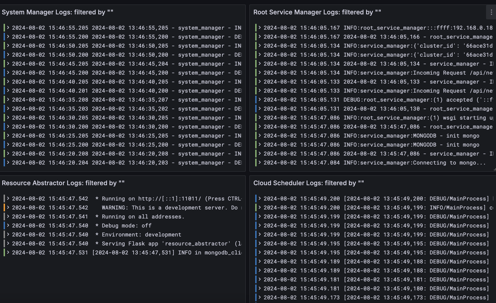
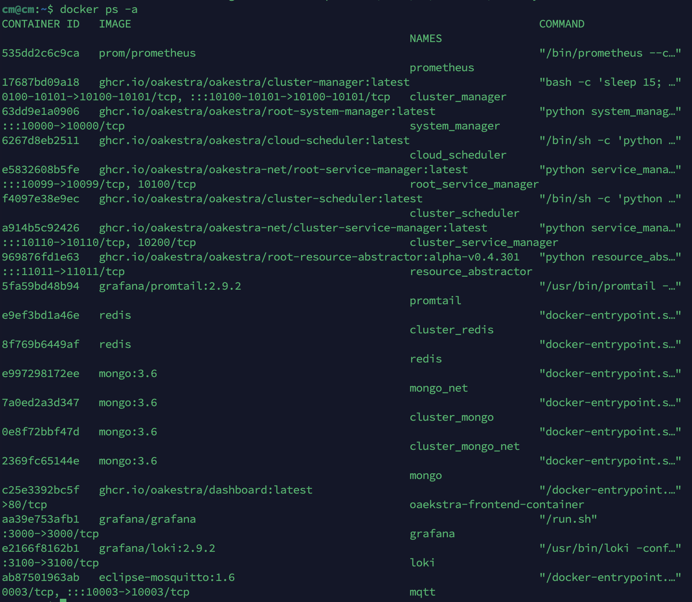
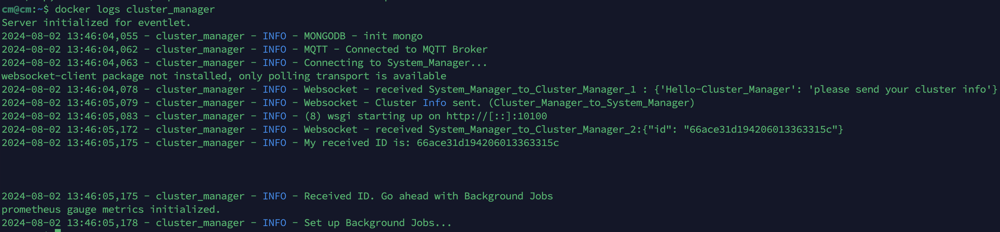

## How can I access Root and Cluster orchestrator logs?

You have two ways: **(A)** Grafana Dashboard or **(B)** docker logs.

### Using Grafana Dashboard

The Grafana dashboards are exposed at <root_orchestrator_ip>:3000 and <cluster_orchestrator_ip>:3001, respectively. 


The cluster Grafana dashboard is not available for 1-DOC deployments. For 1-DOC all the data is aggregated in the same dashboard.




### Using docker logs 

Run `docker ps -a` on the orchestrator machine to check all running containers. 



Then simply run `docker logs <container name>` to check its logs. 



## How do I access Worker Node control plane logs?

### Node Engine 
On Node Engine v0.4.203 and above you can use 

```
sudo NodeEngine logs
```

Or you can manually access the logs in 

```
/var/log/oakestra/nodeengine.log
```

### Net Manager

On Net Manager v0.4.203 and above you can access the logs at 

```
/var/log/oakestra/netmanager.log
```

## How do I activate Debug Mode in NetManager? 

In NetManager v0.4.302 or above add the debug `true` flag in your `netcfg.json` file as follows:

1: Stop the Worker Node using `sudo NodeEngine stop`

2: Edit the `netcfg.json` file located at `/etc/netmanager/netcfg.json` and add `"Debug": true`

```json  {title="/etc/netmanager/netcfg.json"}
{
  "NodePublicAddress": "0.0.0.0",
  "NodePublicPort": "50103",
  "ClusterUrl": "0.0.0.0",
  "ClusterMqttPort": "10003",
  "Debug": true
}
```
3: Restart the Worker Node using `sudo NodeEngine start`


If you're running NetManager and NodeEngine **v0.4.301 or previous releases**, just start the NetManager using the `-D` flag.
E.g., `NetManager -p 6000 -D`

You can check your NodeEngine version by running `NodeEngine version`



## Where do I find Worker NetManager logs? 

From `v0.4.302` NetManager logs are available in `/var/log/oakestra/netmanager.log`

## How to access Root Orchestrators DB?

You can access a live MongoDB shell of each one of the Oakestra's databases by running the following commands:

For the System Manager DB run:
```bash
docker exec -it mongo mongo localhost:10007
```

For the Root Service Manager DB run:
```bash
docker exec -it mongo mongo_net localhost:10008
```


This command opens a shell to the corresponding MongoDB instance running on the root orchestrator. From here, you can run MongoDB commands to query the database.

For example:
```bash
show dbs #shows all available databases.
```

```bash
use clusters #move to the clusters database
```

```bash
db.clusters.find().pretty() #pretty print of the clusters collection
```

```bash
use jobs #move to the jobs database
```

```bash
db.jobs.find().pretty() #pretty print of all the jobs
```
## How do I access Cluster Orchestrator DB?

You can access a live MongoDB shell of each one of the Oakestra Cluster's databases by running the following commands:

For the System Manager DB run:
```bash
docker exec -it cluster_mongo mongo localhost:10107
```

For the Root Service Manager DB run:
```bash
docker exec -it cluster_mongo_net mongo_net localhost:10108
```

This command opens a shell to the corresponding MongoDB instance running on the cluster orchestrator. From here, you can run MongoDB commands to query the database.

