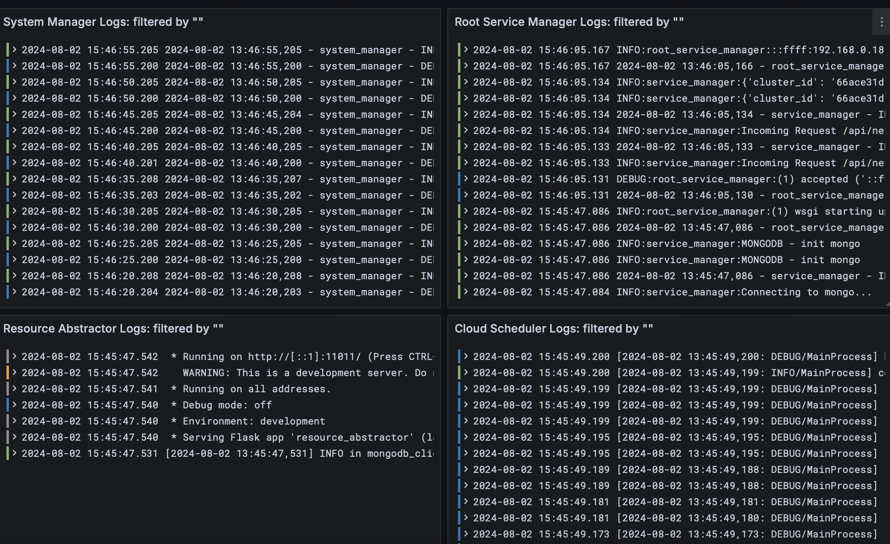


Oakestra offers built-in tools and clear workflows to help you identify, diagnose, and resolve issues quickly. Whether you’re facing unexpected application behavior, slow performance, or deployment failures, Oakestra provides a streamlined process for gathering diagnostic information and guiding you toward solutions.


At this stage, you should be familiar with the steps of configuring and running any application within Oakestra and know the main parts of the operations. If not, please refer to the [Getting Started](/docs/getting-started) section and other relevant sections of this documentation.

## Check orchestration logs

The first debugging step is to identify where the issue is coming from. The Root and Cluster orchestrators are the main components of the Oakestra system. They are responsible for managing the applications and the workers in the cluster.
You have two ways to access operational logs from the components 

### Using Grafana Dashboard

The Grafana dashboards are exposed at `<root_orchestrator_ip>:3000` and `<cluster_orchestrator_ip>:3001`, respectively. 


The cluster Grafana dashboard is not available for single machine deployments. For this setup, all the data is aggregated in the same dashboard.


### Using Docker logs 

Run `docker ps -a` on the orchestrator machine to check all running containers. 

Then simply run `docker logs <container name>` to check its logs. 

The logs are your best friend in identifying the root cause of the issue. Specially check for runtime errors, warnings, and exceptions.

## Run diagnostics commands

You can also run live diagnostics commands to check the status of the components using `oak-cli`. 



Continue reading to learn more about the debugging specific aspects of the Oakestra ecosystem.