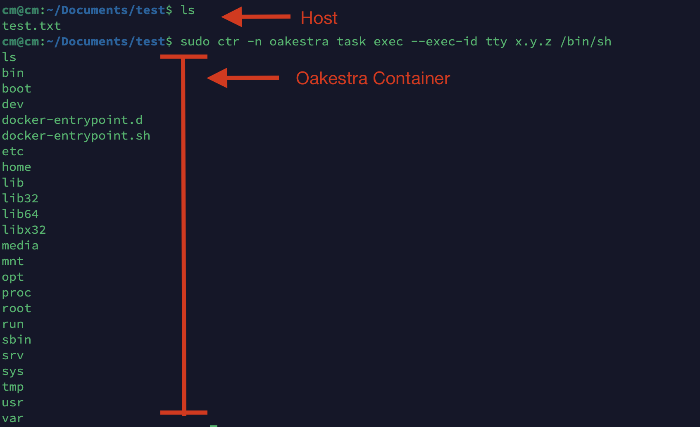

# How to access a running container?

If you need to access a running container in your worker node, the correct way of doing it is via the `ctr` utility. `ctr` is the cli of `containerd`, the runtime used by oakestra to deploy containers. 
Oakestra uses a custom namespace `oakestra` where all the containers are. 

In `containerd` we distinguish between tasks and containers. A container is the environment, the filesystem, and all the metadata. A task is a process running in such an environment. 

Therefore, to check all running containers on a given worker node you can use:

```bash
sudo ctr -n oakestra container ls
```

To check all running tasks you can use the following: 

```bash
sudo ctr -n oakestra task ls
```

If you wish to attach and execute commands inside a running container, you can use:

```bash
sudo ctr -n oakestra task exec --exec-id tty <your task name here> <the command you wish to execute>
```

>E.g., to use a shell inside the container x.y.z we can use
> ```bash
> sudo ctr -n oakestra task exec --exec-id tty x.y.z /bin/sh
> ```
>

# Where are the logfiles stored?

The `stdout` and `stderr` of each container or unikernel is stored under `/tmp/<appname>.<appns>.<servicename>.<servicens>.<instancenumber>` of the worker node running the instance.

> E.g., to access the latest logs of instance 0 of `x.y.z.y` in my worker node I can run `tail /tmp/x.y.z.y.0`

# What about Unikernels?

While you cannot directly attatch yourself to a running Unikernel, the logs are extracted, stored and treaded the same way as containers. 

