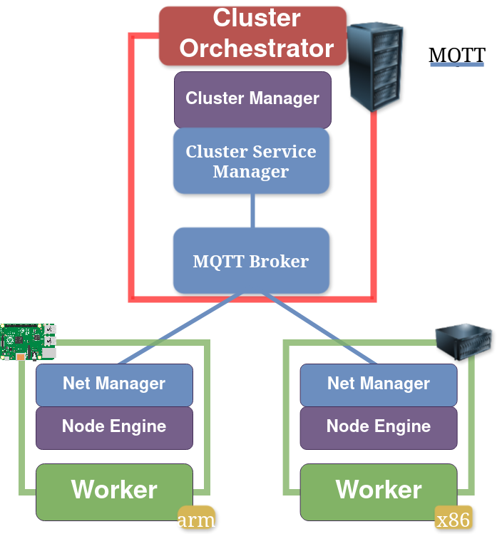

## Intra-Cluster Communication



The above image shows how intra-cluster communication takes place. Nodes send application status and node health reports to the cluster-service-manager.
The cluster-service-manager then appropriately propagates this information to other nodes and the root-service-manager. Since the nodes report sensitive information, such
as IP Addresses, we highly recommend securing the MQTT channels.

 
MQTT is a lightweight messaging Protocol that supports publishing/subscribing to named channels. Oakestra uses MQTT due to it's minimal network usage and low processing overhead. More information at [mqtt.org](https://mqtt.org/).



## MQTTS
MQTT supports the exchanging of certificates to establish a TLS secured channel. For this the server (MQTT Broker) and every 
client require a certificate-keyfile pair singed against the same certificate Authority (CA).
The MQTT broker can be configured to only accept incoming secured connection, and to identify devices by their certificate CN entry.

## Enable Moqsuitto Authentication

 
* You have a running Oakestra deployment
* You have at least one worker node registered
* (Optional) The NetManager is installed and properly configured
* Check out the [Getting Started](../../../getting-started/oak-environment/create-your-first-oakestra-orchestrator) for more details



### Configuring the Cluster Manager


Navigate into the `cluster_orchestrator` directory in the oakestra repository.

1. Configure the MQTT Broker by adding the following lines to the `mosquitto/mosquitto.conf` file:
    ```
    cafile /certs/ca.crt
    certfile /certs/server.crt
    keyfile /certs/server.key

    require_certificate true
    use_identity_as_username true
    ```
2. Generate the certificates in the `./certs` directory
    * **MQTTS (Server):**
       1. Generate CA authority key:
          `openssl req -new -x509 -days <duration> -extensions v3_ca -keyout ca.key -out ca.crt`
       2. Generate a server key:\
          `openssl genrsa -out server.key 2048`
       3. Generate a certificate signing request including the URL as a SAN:\
          `openssl req -out server.csr -key server.key -new -addext "subjectAltName = IP:${SYSTEM_MANAGER_URL}, DNS:mqtts"`\
           When prompted for the CN, enter `mqtts`
       4. Send the CSR to the CA\
           `openssl x509 -req -in server.csr -CA ca.crt -CAkey ca.key -CAcreateserial -out server.crt -days <duration> -copy_extensions copyall`
       5. Grant permissions to read the server keyfile:\
            `chmod 0644 server.key`
    * **Cluster Manager (Client):**
        1. Generate a client key:\
            `openssl genrsa -aes256 -out cluster.key 2048`
        2. Generate a certificate signing request:\
            `openssl req -out cluster.csr -key cluster.key -new`\
            When prompted for the CN, enter `cluster_manager`
        3. Send the CSR to the CA:
            `openssl x509 -req -in cluster.csr -CA ca.crt -CAkey ca.key -CAcreateserial -out cluster.crt -days <duration>`
        4. Export the keyfile password as an environment variable:\
            `export CLUSTER_KEYFILE_PASSWORD=<keyfile password>`
    * **Cluster Service Manager (Client):**
        1. Generate a client key:\
          `openssl genrsa -aes256 -out cluster_net.key 2048`
        2. Generate a certificate signing request:\
          `openssl req -out cluster_net.csr -key cluster_net.key -new`\
          When prompted for the CN, enter `cluster_service_manager`
        3. Send the CSR to the CA:
          `openssl x509 -req -in cluster_net.csr -CA ca.crt -CAkey ca.key -CAcreateserial -out cluster_net.crt -days <duration>`
        4. Export the keyfile password as an environment variable:\
          `export CLUSTER_SERVICE_KEYFILE_PASSWORD=<keyfile password>`

3. Deploy the cluster with the MQTTS override
`sudo -E docker compose -f docker-compose.yml -f override-mosquitto-auth.yml`

### Configuring a Node
<!--- Subject to change when NodeEngine and NetManager are demonized -->

1. Copy the `ca.crt` and `ca.key` files to the worker node.
2. Generate the certificates
   1. Generate a client key:\
       `openssl genrsa -aes256 -out client.key 2048`
   2. Generate a certificate signing request:\
       `openssl req -out client.csr -key client.key -new`\
       When prompted for the CN, enter the public IP of the machine
   3. Send the CSR to the CA:\
       `openssl x509 -req -in client.csr -CA <path to ca file> -CAkey <path to ca key file> -CAcreateserial -out client.crt -days <duration>`
   4. Decrypt the keyfile:\
        `openssl rsa -in client.key -out unencrypt_client.key`
   5. Tell your OS to trust the certificate authority by placing the ca.crt file in the `/etc/ssl/certs/` directory
3. Run the NodeEngine:\
       `sudo NodeEngine -n 0 -p 10100 -a <SYSTEM_MANAGER_URL> -c <path to client.crt> -k <path to unencrypt_client.key>`
4. (Optional) Run the NetManager:\
        1. Repeat step 2 for the NetManager\
        2. Edit the `/etc/netmanager/netcfg.json` file so that the `"MqttCert"` and `"MqttKey"` fields specify the path to the NetManager certificate and key files\
        3. Execute `sudo NetManager -p 10100`


 The [Oakestra automation repository](https://github.com/oakestra/automation)
contains many useful scripts such as ones for [creating MQTTS certificate files](https://github.com/oakestra/automation/tree/d43f701134fdf71e1206532883006e1937c38ef9/development_cluster_management/generate_mqtts_certificates). 